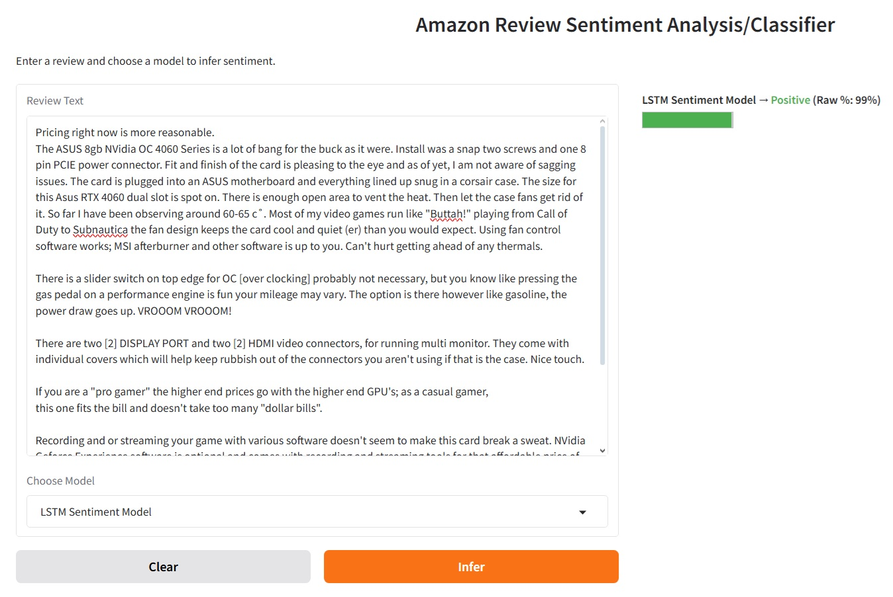
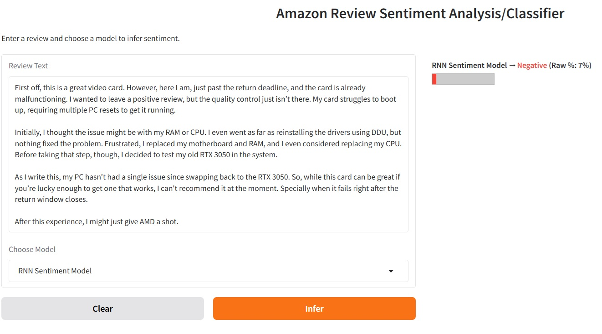

<h1> Sentiment Analysis of 4 millions Amazon Reviews using Natural Language Processing </h1>

<h3> Problem Statement </h3>

The project seeks to apply Natural Language Processing to Sentiment Analysis of a dataset containing 4 million Amazon reviews.  Upon training completion of the project's deep models, they can be used for inference on unseen Amazon reviews from the Amazon website.

<h3> Background </h3>

The vast amount of text data from reviews, discussions and X-posts, for example, have created a frenzy for companies to capitalize on this ocean of information for any actionable “intel.”  For example, restaurants are eager to know how their brand is faring in the public’s eyes.  Are foodies raving about their latest creation or are they lukewarm when it comes to the restaurant’s ambience?  Why do their patrons mostly skip the appetizers?  In finance, trading houses are keen on the latest X-post from Elon or any well-regarded financial pundits that can potentially send a stock to the moon or collapse it.  In retail like Amazon, it is critical to know what products are selling and not selling but more importantly, why?   What about the latest geo-political news? The latest trend posts from the Kardashians?  All these conversations, opinions and reviews have vast implications because of the speed which information travels and of the reach of social media.  Therefore, whether it is a restaurant or a fashion brand looking to improve their products or a trading house looking to improve their trading profit, sentiments play a key role in their success.

<h3> Methodology </h3>

The project will focus on using Kaggle’s Amazon Reviews dataset to train, validate, test and evaluate Sentiment Analysis utilizing Natural Language Processing Models. Inference will be conducted on real-time reviews that users can input. The training, validating, testing, evaluating and inferencing will entail a supervised learning approach to a classification task.   The Kaggle dataset has “ground truth” that are correctly labeled.   The project will implement the underlying NLP models using self-trained and pre-trained deep models, mainly.  The project will not focus on shallow models such as Logistic Regression, Support Vector Machine or Naive Bayes, for example.   

<h3> Data Selection </h3>

As mentioned previously, the project will be utilizing the 4 million Amazon Reviews dataset.   It is available from https://www.kaggle.com/datasets/kritanjalijain/amazon-reviews/data   The dataset consists of 3.6M Amazon reviews in the training set and 400,000 in the testing set.

<h3> Expected Outcomes </h3>

Upon project completion, various deep learning models will be able to infer unseen Amazon reviews which the users can input into the demonstration application in real-time. 

Here are two examples using the demonstraton application. First example is a positive Amazon review. Here's the link to the Amazon review on Amazon:

[Original Amazon review](https://www.amazon.com/gp/customer-reviews/R2K8MBRGFPSZ3L)

Sentiment Analysis of the same Amazon review using the LSTM model:

Here is the second example. It is a negative Amazon review on Amazon:

[Original Amazon review](https://www.amazon.com/gp/customer-reviews/R1RLY0GI4V94MK)

Sentiment Analysis of the same Amazon review using the RNN model:

<h3> Future Improvements and Considrations </h3>

The project have built a foundation for applying deep models to Sentiment Analysis. Further exploration can include but not limited to

- Multi-Class Classification.
  - The Kaggle dataset contains only binary labels: positive or negative.
  - The project's deep model can be retrofitted to classify multi-class labels such as positive, neutral or negative.
- Additional Models
  - The project have focused solely on deep models. However, depending on the use case, shallow models may be more appropriate and even preferred.  For example, interpretability and small and expertly curated dataset.  When interpretability is a priority and paramount to the problem statement, then shallow model provides a better path to explainability.  Additionally, deep models require large dataset to train to avoid overfitting.  Small, expertly curated dataset would be more suited for shallow models.
- Ensemble Classification
  - Combine both shallow and deep models to classify reviews.  Use a weighted (models with higher accuracy receives higher weights) result or simple voting in an ensemble approach to classify a review.
- Domain and Context Adaption
  - Train the project's models on other domain specific data like healthcare or fintwit (finance and market specific tweets or posts) or other e-commerce reviews.
  - Utilizing zero-shot or few-shot learning
- Deployment and Accessibility
  - FastAPI for web integration 
- Multi-Language Support
  - Extend the model to support other languages besides English